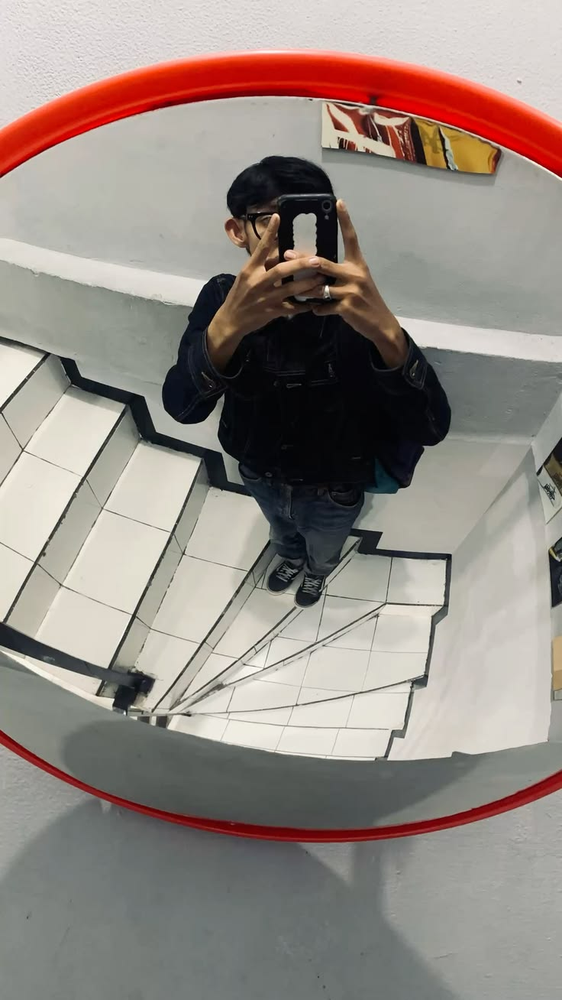

# ☕ Deadline Enjoyer — Coffee Shop Web App

<div align="center">


<br /><br />

<h1>☕ Deadline Enjoyer</h1>
<p><i>“Turning pressure into precision, brewing code like coffee.”</i></p>

</div>

---

## 📖 About The Project

**Deadline Enjoyer** adalah aplikasi **web coffee shop berbasis fullstack** yang dirancang untuk mensimulasikan sistem pemesanan kopi secara modern dan profesional.

Aplikasi ini memungkinkan pengguna untuk:
- Melihat daftar menu kopi
- Melakukan pemesanan
- Mengelola data produk dan transaksi
- Menggunakan sistem backend API yang terstruktur

Proyek ini dibuat sebagai **proyek kolaborasi tim** dengan tujuan menerapkan praktik pengembangan web profesional.

---

## 👥 Team Deadline Enjoyer

<div align="center">

### 🧑‍💼 Project Manager
| |
| :---: |
|  |
| **Syahril Arif Adriansyah** |
| <sub>Full Stack Developer</sub> |

<br>

### 👨‍💻 Core Developers

| | | |
| :---: | :---: | :---: |
|  |  |  |
| **M. Rizqi Nurrohmat** | **M. Shidqi Hanif Firdaus** | **Harun Yahya** |
| <sub>Full Stack Developer</sub> | <sub>Full Stack Developer</sub> | <sub>Full Stack Developer</sub> |

<br>

| |
| :---: |
|  |
| **Achmad Raihan** |
| <sub>Full Stack Developer</sub> |

</div>

---

## 🛠️ Tech Stack

### ☕ Frontend
- React.js / Next.js
- HTML5, CSS3, JavaScript
- Tailwind CSS / Bootstrap

### ☕ Backend
- Node.js
- Express.js / Laravel
- RESTful API

### ☕ Database
- PostgreSQL / MySQL

### ☕ Tools & Environment
- Git & GitHub
- Docker
- Postman
- Kali Linux

---

## ✨ Features (Planned)

- 📋 Coffee menu management
- 🛒 Order & checkout system
- 👤 User authentication
- 📦 Admin dashboard
- 📊 Order history & reports

---

## 🚀 Getting Started

### 📥 Clone Repository
```bash
git clone https://github.com/RizqiNur27/Proyek-Pemrograman-Fullstack-.git
cd Proyek-P